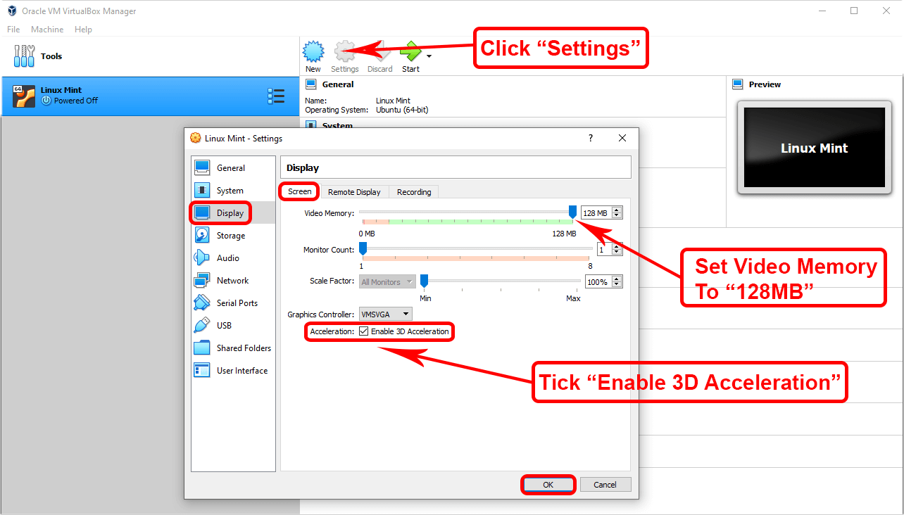
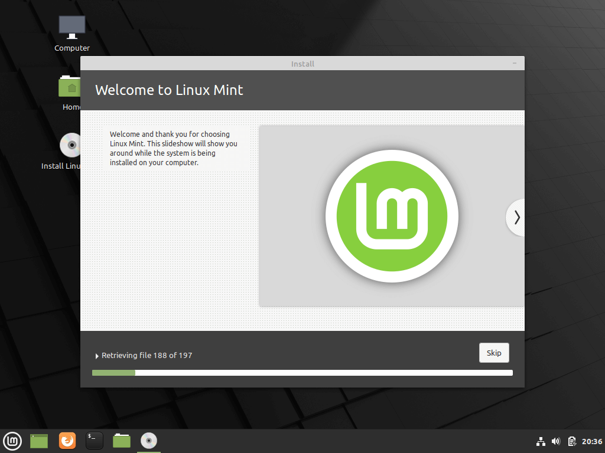
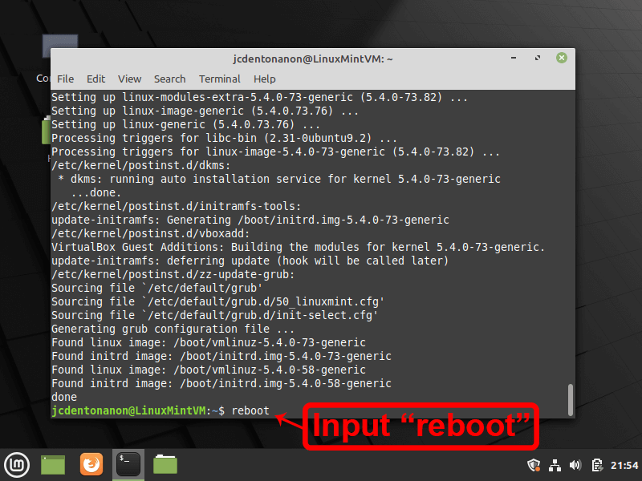
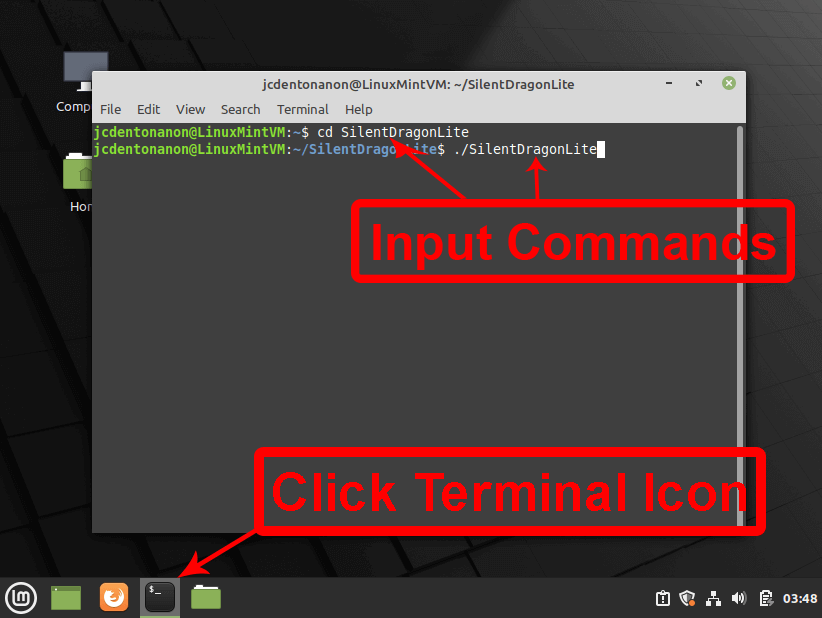

# How to run SDL using a Linux Mint Virtual Machine (VM) on Windows/Mac

This is a HowTo written by JC Denton to help Hush users who are still running Windows or Mac OS to get up and running with the Hush Light Wallet called SilentDragonLite, or SDL. **This HowTo will bring you from start to finish.** The markdown formatting was done by jahway603. Let us know if you find any errors.

## Install Virtual Box on your computer

1. First Download & Install “VirtualBox” by [clicking here](https://www.virtualbox.org).
    

1. Next choose which operating system you are going to run VirtualBox on and let the download begin.
    

1. After download is complete, go to the location where you downloaded the file and double click to install.

## Download Linux Mint

Here you download the newest version of Linux Mint available.

System requirements:
    * 1GB RAM (2GB recommended for a comfortable usage)
    * 15GB of disk space (20GB recommended)

1. Go to the [Linux Mint website here](https://linuxmint.com) and click on Download.
    

1. It is recommended to download the “Cinnamon” desktop environment as it most resembles Windows, and so will be easier to use for those new to Linux.
    

1. It is recommended that you download from a mirror nearest to your location for faster download speeds.
    

## Run VirtualBox and Install Linux Mint

1. You will first be presented with the screen below. Click “New”, then name your new Virtual Machine, or VM, anything you wish, and click “Next”.
    

1. On the next screen, allocate the amount of RAM that will be available to your VM. 2GB is recommended (1GB minimum). Then click “Next”.
    

1. Next choose “Create a virtual hard disk now”, and click “Create”.
    

1. Select “VDI (VirtualBox Disk Image)”, and click “Next”.
    

1. Select “Dynamically allocated”, and click “Next”.
    

1. Allocate the amount of hard disk space available to your installation. 20GB is recommended (15GB minimum). Click “Create”.
    

1. Once your VM template is created, it can be customised further. Click “Settings”, then click “System” in the left bar, and specify the number of CPUs to make available to your VM.
    

1. Next click “Display”. Allocate your chosen amount of video memory, and tick the box “Enable 3D Acceleration”.
    

1. Click “Storage”, then “Empty”, then the little blue disk icon, and in the proceeding popup click “Choose a disk file...”.
    

1. Locate the Linux Mint .iso file you downloaded earlier, click it, and then click “Open”.
    

1. “Empty” has now been replaced by the Linux Mint .iso image. Click “OK”.
    

1. Click “Start”.
    

1. You should now see the following VM window pop up. Click “Start”.
    

1. You will be presented with the Linux Mint live boot window. Press the “Enter” key, or wait for the automatic boot countdown to end.
    

1. You are now on the live version of Linux Mint. This version doesn’t save changes made but it is useful for testing the operating system. We will now have to install Linux Mint it order to make it permanent and enable changes to be saved. Double click “Install Linux Mint”.
    

1. Select your language and click “Continue”. 
    

1. Select your keyboard layout and click “Continue”.
    

1. Tick “Install multimedia codecs” and click “Continue”.
    

1. Ensure that “Erase disk and install Linux Mint” is selected and click “Install Now”.
    

1. Click “Continue”.
    

1. Select your location to determine timezone and nearest system update servers, and click “Continue”.
    

1. Choose a name, computer name, username and password. Then click “Continue”.
    

1. The installation process will now start.
    

1. Once installation is complete, click “Restart Now”.
    

1. Press the “Enter” key.  
    

1. Once Linux Mint restarts, enter your password and press the “Enter” key.
    

1. Click the little “x” button to close the welcome screen window.
    

1. Next we have to install additional software in order to be able to make the Linux Mint desktop switchable to full-screen mode. Click “Devices” and then “Insert Guest Additions CD image...”.
    

1. In the proceeding pop-up window, press “Run” to begin download and installation of the additional software.
    

1. Enter your password and press “Authenticate”.
    

1. Once process is complete, press “Enter” key.
    

1. Right click on the disc icon and click “Eject”.
    

1. Click “View” and “Full-screen Mode”. To enter and exit full-screen mode, you can also use the default shortcut keys “Right CTRL + F”.
    

### Install system updates & configure firewall

**Note: Technically this section is optional but makes your system more secure and is therefore recommended.**

1. Click the terminal icon and copy and paste the following to update your system.  
    ```sudo apt-get update && sudo apt-get upgrade && sudo apt-get dist-upgrade```

1. Press the “Enter” key, input your password and press the “Enter” key again.
    

1. When prompted, type “y” for yes and press the “Enter” key.
    

1. Once complete, type “reboot” and press the “Enter” key to complete the updating process.
    

1. Next we will enable the firewall to increase system security. Press the “Menu” icon, then “Preferences”, then click “Firewall Configuration”.
    

1. Next type your password and press “Authenticate”.
    

1. Lastly, click highlighted button to enable the firewall and press the little “x” button to close.
    

## Compile Silent Dragon Lite (SDL) from source

Before intalling SDL, we need to first install the software it relies on to function. This includes QT5, Git and Rust. We will again need to use the terminal and input commands. Depending on the specifiction of your system, and the amount of resources you have allocated to the VM, some of these commands can take time to process, so please be patient.

#### QT5 Installation

1. Click on the terminal icon, and copy and paste the following command and press the “Enter” key.  
    ```sudo apt-get -y install qt5-default qt5-qmake libqt5websockets5-dev qtcreator```

1. Press the “Enter” key, input your password and press the “Enter” key again.
    

#### Git Installation

1. Copy and paste the following command and press the “Enter” key.  
    ```sudo apt install git```  
    

1. When prompted, type “y” for yes and press the “Enter” key.
    

#### Rust Installation

We require a newer version of Rust (and Cargo) then what is typically available to install from the Linux Mint folks (and most other Linux distributions), so we show you how to do this here. 

**Please take NOTE that it is a VERY BAD practice to download a script and just start running it without understanding what it is doing.**
Unfortunately the rust developers [ask their users to do this](https://www.rust-lang.org/tools/install), but we believe they could find a better way. I was unable to find a Linux Mint software source for rustup, so we'll have to deal with it this one time.

1. Copy and paste the following command and press the “Enter” key.  
    ```curl --proto '=https' --tlsv1.2 -sSf https://sh.rustup.rs | sh```  
    

1. When prompted, type “1” for default install, and press the “Enter” key.
    

1. To complete the process and restart the current shell, copy and paste the following command and press the “Enter” key.  
    ```exec bash```  
    

### Silent Dragon compile time

1. Copy and paste the following command and press the “Enter” key.  
    ```git clone https://git.hush.is/hush/SilentDragonLite```  
    

1. Copy and paste the following command and press the “Enter” key.  
    ```cd SilentDragonLite```  
    

1. Copy and paste the following command and press the “Enter” key.  
    ```./build.sh linguist```  
    

1. Copy and paste the following command and press the “Enter” key.  
    ```sudo apt install build-essential```  
    

1. If asked, type your password and press the “Enter” key.

1. When prompted, type “y” for yes and press the “Enter” key.
    

1. The next step usually takes the longest. Copy and paste the following command and press the “Enter” key.  
    ```./build.sh```  
    

1. Now the install process is complete. To start SDL, copy and paste the following command and press the “Enter” key.  
    ```./SilentDragonLite```  
    

## Now SDL is running

### Restoring a wallet from seed phrase

Note: If you want to create a new wallet, skip this section and go to the next one called "Creating a new wallet”.

**Important note:** There is currently a bug preventing buttons within the wallet from being visible when running on a VM. This can be worked around by clicking when your mouse pointer is on a button, and keeping it pressed. To not select the button, move the mouse pointer off the button before lifting your finger so as not to click it. 

1. Firstly select “I accept the Terms of Service”. Then type a password for your wallet. Then select “Recover wallet from seed” and click the “Next” button.
    

1. Input both your seed phrase and wallet birthday number. If you don’t know this number, just type “0”. Finally, click the “Finish” button.
    

1. Wait for wallet to sync.  
    

1. When the wallet is synced, you will see a green checkmark in the bottom corner. It is now ready to use.
    

### Creating a new wallet

**Important note:** There is currently a bug preventing buttons within the wallet from being visible when running SLD on a VM. This can be worked around by clicking when your mouse pointer is on a button, and keeping it pressed. To not select the button, move the mouse pointer off the button before lifting your finger so as not to click it. There is also currently a bug when selecting the option to create a new wallet. Follow the instructions carefully to proceed successfully.

1. Firstly select “I accept the Terms of Service”. Then type a password for your wallet. To get around the bug mentioned preciously, first select “Recover wallet from seed”, and then select “Create a new wallet. Finally press the “Next” button.
    

1. You will be presented with both a seed phrase and birthday of seed number. Make sure to back up both of these in a safe place.
    **Important Note: Without your seed phrase, it is impossible to recover your wallet and any funds contained within it will be lost.**
    

1. Next you will have to input your seed phrase and birthday of seed number in order to confirm you have made a backup of these details. This process is made more difficult by the existence of the invisible buttons bug, and so, will take longer than it should to complete. When both have been input, and in the correct order, press the “OK” button.
    

1. Wait for wallet to sync.  
    

1. When the wallet is synced, you will see a green checkmark in the bottom corner. It is now ready to use.
    

## How to run SDL after installation


1. Click the terminal icon. Copy and paste the following command and press the “Enter” key.  
    ```cd SilentDragonLite```

1. Then copy and paste the following command and press the “Enter” key.  
    ```./SilentDragonLite```

1. SDL will now start and sync to the latest block.

