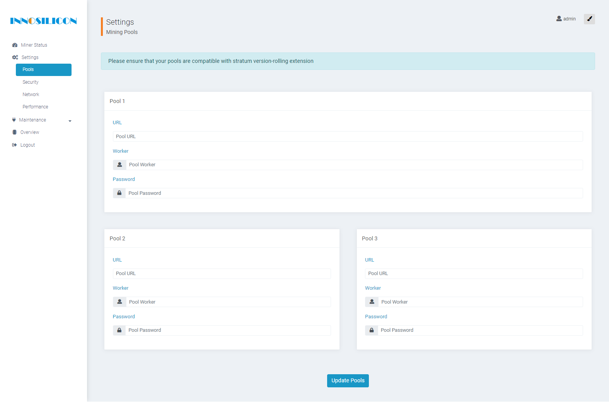

# Setup your Hush Innosilicon Miner

This documentation is how to setup an Innosilicon A9 Miner and start mining Hush. In this example, we are using [Luckpool](https://luckpool.net), so change to what you are using.

## Where to begin

### First Steps

1. Connect your ASIC to power and internet connection.

1. Determine what the IP address is on your Innosilicon ASIC.

1. Open it and login in via your web browser.

1. In the Web UI Menu, click on Settings and then click on Pools.

### Configure Mining Pools

1. Setup your pool as follows and ***Note your required port*** from [this list](https://luckpool.net/hush/connect.html). In this example, we're using port 3761 as this ASIC is 50K/sol. Set up different geographical mining pools here so that the miner can failover from Pool 1 to Pool 2, etc. Again, changed if needed.

	- Under Pool 1
		- Change URL to "stratum+tcp://na.luckpool.net:3761"
		- Change Worker to your z-address
		- Change Password to X

	- Under Pool 2
		- Change URL to "stratum+tcp://eu.luckpool.net:3761"
		- Change Worker to your z-address
		- Change Password to X

	- Under Pool 3
		- Change URL to "stratum+tcp://ap.luckpool.net:3761"
		- Change Worker to your z-address
		- Change Password to X

1. Then click on Update Pools at the bottom of the Mining Pools Settings webpage.

1. Success as you hear your miner spin up! Check the Miner Status in the web UI to verify that it is actually mining.

## Mining support

The Hush Team does not operate or support any mining pools at this time. If you need support of your mining pool, then please seek your mining pool support.

