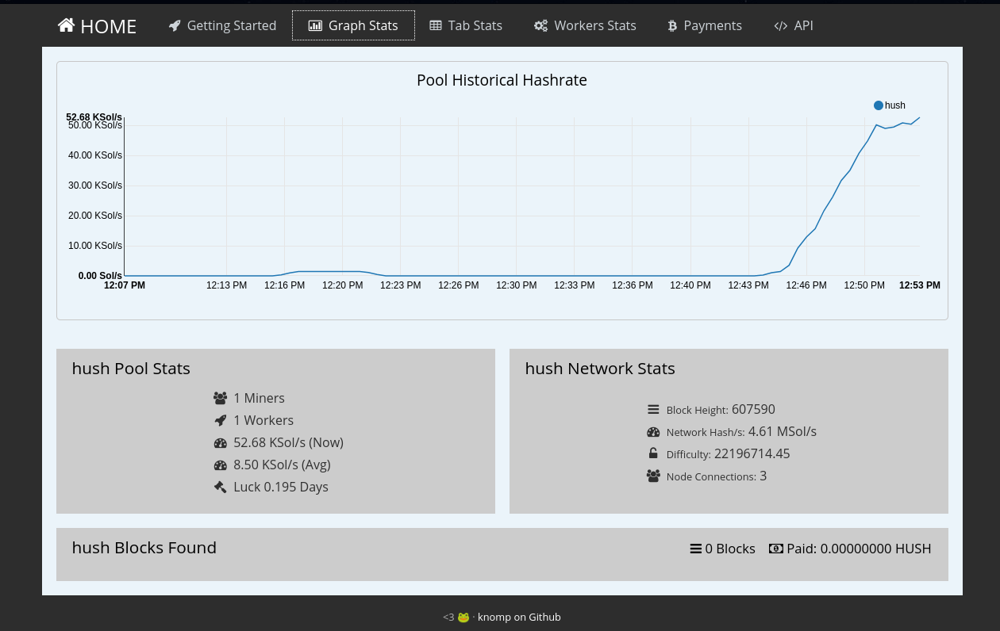

# Setup your Solo Miner for Hush


This documentation is how to start solo mining Hush with an Innosilicon A9 (ASIC) Miner and be your own "Hush Solo".

## Overview

For this setup we will have our computer running hushd and we will have our ASIC Miner connecting to it. In this write-up we are using a Linux computer. This might work on Windows or Mac, but that is beyond the scope of this document. If you do successfully test with these surveillance operating systems, then feel free to do a pull request to add your input in here.

### Pre-setup

1. Make sure you know the IP address of your ASIC miner. If you're not sure how to figure that out then do a [Startpage search](https://startpage.com) to learn how. It is outside the scope of this document.

1. Make sure you know your desktop computer's IP address.

1. Follow compilation or installation of the [Hush daemon](https://git.hush.is/hush/hush3/) onto your desktop computer, which is outside of the scope of this document. 

### Desktop computer setup

First we need to setup the Hush configuration on our computer.

1. Open your HUSH3.conf, which should be located in your home directory at ~/.komodo/HUSH3/HUSH3.conf.

1. Make sure you add the IP address of your ASIC miner into the conf file. The following is an example using 192.168.33.66 as the ASIC miner's IP:
	```
	rpcuser=user-choose-your-own
	rpcpassword=PASSWORD0123456-make-it-custom
	rpcport=18031
	server=1
	txindex=1
	rpcworkqueue=256
	rpcallowip=127.0.0.1
	rpcallowip=192.168.33.66
	rpcbind=127.0.0.1
	```

	Change the ```rpcuser``` and ```rpcpassword``` above to something unique as it will be used later.
	Note: If you had more than 1 ASIC, then each one would get it's own rpcallowip line item.

1. Next we start the hush daemon (hushd) at the command line with special options to enable a stratum server.

	```
	./src/hushd -stratum -debug=stratum -stratumallowip=192.168.0.0/16
	```	

	Substitute your hushd path and your local network appropriately in the above command.

1. Check that the stratum is started by seeing that it is listening on the correct port (default 19031).

	```
	ss -lnt | grep 19031
	```

1. Your desktop computer needs to download & sync the Hush blockchain completely before you continue. You can check its status with the following command after waiting a couple of minutes after hushd has been started up ```hush-cli getinfo | grep synced```. When that value is true, then continue.

1. We need to get a t-addresses (yes, transparent garbage) to be able to mine solo. We generate a new t-address with this command:
	```
	hush-cli getnewaddress
	```

	"address": "FIRST-newly-generated-t-address-you-own",

### ASIC Miner setup

1. Open the web UI and login in via your web browser.

1. In the Web UI Menu, click on Settings and then click on Pools.


### Configure Solo Mining

1. Setup your "pool" as follows with this example using 192.168.33.101 as the desktop computer's IP address.

	- Under Pool 1
		- Change URL to "http://stratum+192.168.33.101:19031"
		- Change Worker to the newly-generated-t-address-you-own from your Hush wallet. It's also a good idea to create and use new addresses every so often for better privacy.
		- Change Password to whatever you want, some just use "X"

	- Under Pool 2 & Pool 3 we leave as-is

1. Then click on Update Pools at the bottom of the Mining Pools Settings webpage.

1. Success as you hear your miner spin up! Check the Miner Status in the web UI to verify that it is actually mining.



1. Also check the command line on the desktop computer to see any messages that it is working.

## To-Do Items to Clarify

* Have to test this further...

## Mining support

Join us in our Hush mining channel on Telegram, which can [be found here](https://t.me/minersgonnamine). Most miners are not rocking "Hush Solo" style, so make sure you mention that too.

##### Credits

Hush puppies like giving credit when it's due,

1. [This resource](https://github.com/zone117x/node-open-mining-portal) was a great help with writing this as it had in-depth explanation of each option in all of the config files we configured. If you need any other info on certain options, then take a look thru their write-up.

1. [This repository](https://github.com/z-classic/z-nomp/tree/master/pool_configs) is an old Z-NOMP with pool configurations, so these were helpful to see other options, like those special _comments.
