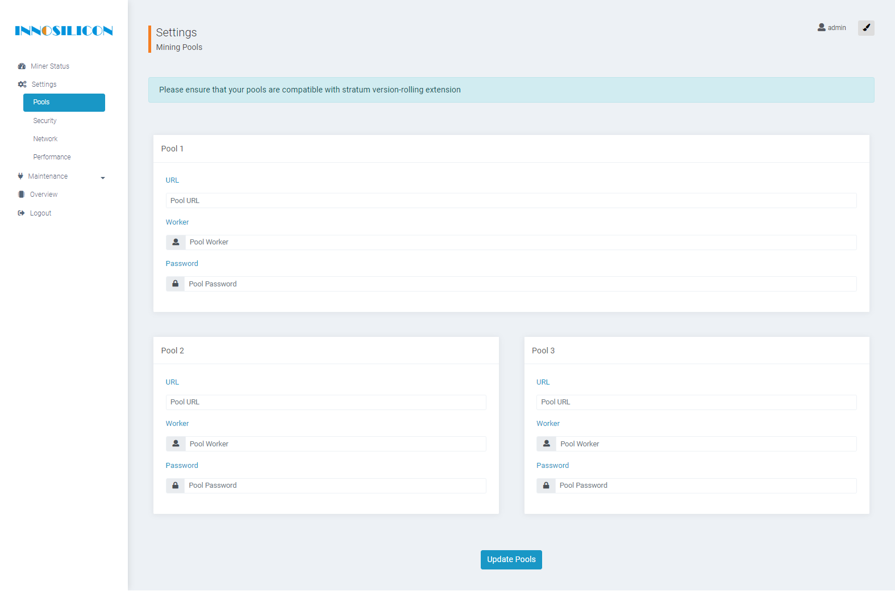

# Setup your Solo Miner for Hush

This documentation is how to start solo mining Hush with an Innosilicon A9 (ASIC) Miner.

## Overview

For this setup we will have our computer running hushd and we will have our ASIC Miner. In this write-up we are using a Linux computer. This might work on Windows or Mac, but that is beyond the scope of this document. If you do successfully test with these surveillance operating systems, then feel free to do a pull request to add your input in here.

### Pre-setup

1. Make sure you know the IP address of your ASIC miner. If you're not sure how to figure that out then do a [Startpage search](https://startpage.com) to learn how. It is outside the scope of this document.

1. Follow compilation or installation of the [Hush daemon](https://git.hush.is/hush/hush3/), which is outside of the scope of this document. It needs to be on your desktop computer before you continue with the Hush blockchain downloaded.

### Desktop computer setup

First we need to setup the Hush configuration on our computer.

1. Open your HUSH3.conf, which should be located in your home directory at ~/.komodo/HUSH3/HUSH3.conf.

1. Make sure you add the IP address of your ASIC miner into the conf file. The following is an example using 192.168.33.66 as the ASIC miner's IP:

```
rpcuser=make-this-unique-username
rpcpassword=MAKE-THIS-UNIQUE-PASSWORD
rpcport=18031
server=1
txindex=1
rpcworkqueue=256
rpcallowip=127.0.0.1
rpcallowip=192.168.33.66
rpcbind=127.0.0.1
```

If you had more than 1 ASIC, then each one would get it's own rpcallowip line item.

1. Then start ```hushd``` at the command line. Once this is running, then continue.

### Setup a NOMP

This section needs to be written still...

### ASIC Miner setup

1. Open the web UI and login in via your web browser.

1. In the Web UI Menu, click on Settings and then click on Pools.



### Configure Solo Mining

1. Setup your "pool" as follows

	- Under Pool 1
		- Change URL to "http://192.168.33.66:18031"
		- Change Worker to whatever you have in HUSH3.conf (our example used make-this-unique-username)
		- Change Password to whatever you have in HUSH3.conf (our example used MAKE-THIS-UNIQUE-PASSWORD)

	- Under Pool 2
		- Leave as-is

	- Under Pool 3
		- Leave as-is

1. Then click on Update Pools at the bottom of the Mining Pools Settings webpage.

1. Success as you hear your miner spin up! Check the Miner Status in the web UI to verify that it is actually mining.

## Mining support

Join us in our Hush mining channel on Telegram, which can [be found here](https://t.me/minersgonnamine).

