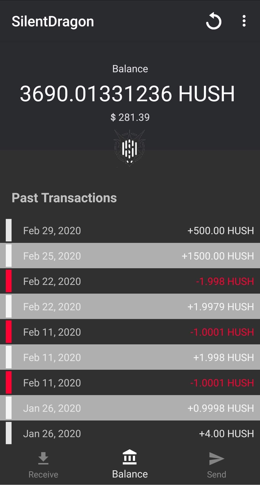

# Silent Dragon Android

This documentation is how you use [Silent Dragon Android (SDA)](https://git.hush.is/hush/SilentDragonAndroid), which is the Hush companion app to work with your wallet on your computer.

## Setup wallet on your computer

First setup your desktop wallet and choose [Silent Dragon](sd.md) or [Silent Dragon Lite](sdl.md)

## Using SDA

You will need to do the following steps on your computer and phone to use SDA.

##### On the Desktop computer

1. Open [SilentDragon](https://git.hush.is/hush/SilentDragon) or [SillentDragonLite](https://git.hush.is/hush/SilentDragonLite) wallet application.

1. At the top, click on Apps and then click on "Connect mobile app".

##### On the phone

1. Open your [SilentDragonAndroid app](https://git.hush.is/hush/SilentDragonAndroid) and click "Scan QR Code" to scan the code on the computer screen.

1. Now they should be paired.

1. Now you can send and receive Hush on your Android phone.

